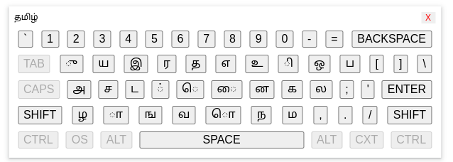

[OPEN TECH FOUNDATION](https://open-tech-foundation.pages.dev/)

<div align="center">

# Ta Input Spec



</div>

> The Thamizhl (தமிழ்) language input specification.

> [!WARNING]
> This spec is in an early stage and subject to change in the future.

### Contents

1. [About](#about)
1. [Keyboard Layout](#keyboard-layout)
1. [Virtual Keyboards](#virtual-keyboards)
1. [Issues in Existing Standards](#issues-in-existing-standards)
1. [Implementations](#implementations)
1. [References](#references)

## About

This specification defines how the **Thamizhl (தமிழ்)** language scripts should be input using computers.

## Keyboard Layout

> [!IMPORTANT]
> This is for the international standard keyboards.

```json
{
  "q": "ு",
  "w": "ய",
  "e": "இ",
  "r": "ர",
  "t": "த",
  "y": "எ",
  "u": "உ",
  "i": "ி",
  "o": "ஒ",
  "p": "ப",
  "a": "அ",
  "s": "ச",
  "d": "ட",
  "f": "்",
  "g": "ெ",
  "h": "ை",
  "j": "ன",
  "k": "க",
  "l": "ல",
  "z": "ழ",
  "x": "ா",
  "c": "ங",
  "v": "வ",
  "b": "ொ",
  "n": "ந",
  "m": "ம",
  "Q": "ூ",
  "W": "ஐ",
  "E": "ஈ",
  "R": "ற",
  "T": null,
  "Y": "ஏ",
  "U": "ஊ",
  "I": "ீ",
  "O": "ஓ",
  "P": "௳",
  "A": "ஆ",
  "S": "ஸ",
  "D": "ஷ",
  "F": null,
  "G": "ே",
  "H": "ஹ",
  "J": "ஜ",
  "K": "ௌ",
  "L": "ள",
  "Z": "ஔ",
  "X": "ஃ",
  "C": "ஞ",
  "V": null,
  "B": "ோ",
  "N": "ண",
  "M": "ௐ"
}
```

## Virtual Keyboards

- The virtual keyboards should indicate the Real-device hardware keyboard key pressing.

- If the Real-Device hardware keyboard `SHIFT` key is pressed, then the virtual keyboard should show the alternate key layout.

- The virtual keyboards implementations should provide an option to choose the Tamil `Unicode` supplemental codes or symbols.

- It should have an option to switch to the `SYSTEM` default input method.

## Issues in Existing Standards

- Non prioritization for thamizhl Vowels & Consonants.
- Using common symbol & number keys to represent the language letters.
- The current implementations does not restrict displaying invalid language combinations letters.
- Usage of obsolete scripts.

## Implementations

- Web
  - [React Ta Input](https://react-ta-input.pages.dev/)

## Contribution

Anyone can contribute to the specification; any changes or improvements can be made through the `Github` pull request workflow.

## References

- [Tamil99](https://en.wikipedia.org/wiki/Tamil_99)
- [InScript](https://en.wikipedia.org/wiki/InScript_keyboard)
- [The Unicode Standard, Version 15.1](https://www.unicode.org/charts/PDF/U0B80.pdf)
- [The Unicode Standard, Tamil Supplement](https://www.unicode.org/charts/PDF/U11FC0.pdf)
